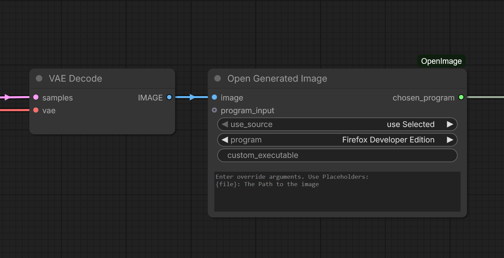
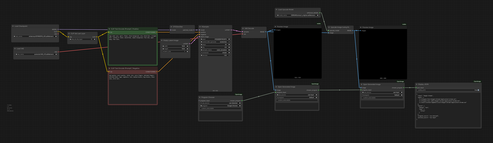

# Comfy-UI OpenImage
It does what it says. Lets you open a generated Image in a specified application after generation.

I didnt find a suitable Extension for this usecase in ComfyUI so i just thought: 

  

[ComfyUI Registry Link](https://registry.comfy.org/publishers/nic-schi/nodes/openimage)

## Usage

Create the Node `Open Generated Image` and then select your Program of choice or type in the Path to a custom executeable.

It will then Open the image in the selected Program.

Have fun :)

### Simple Full Workflow

